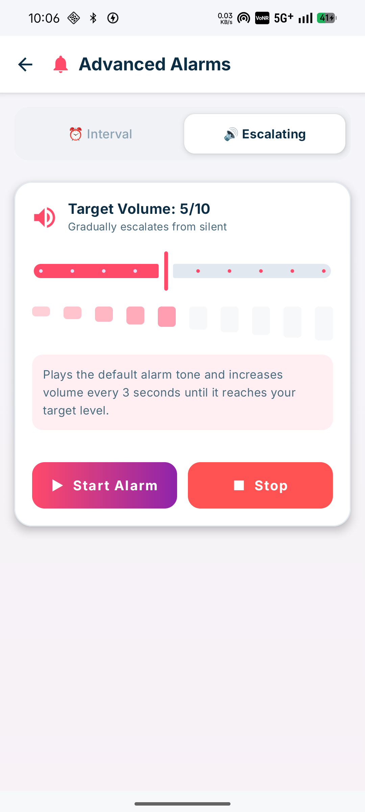
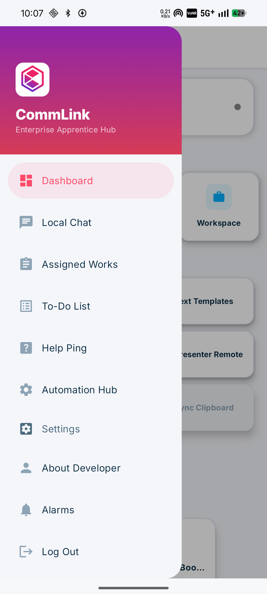
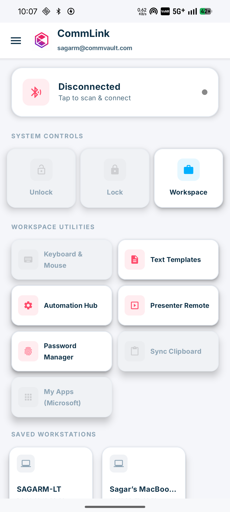
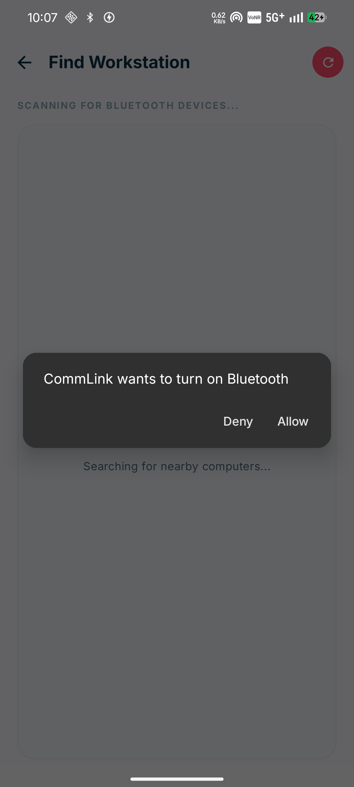
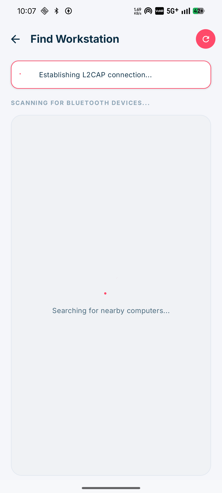

# CommLink: Enterprise Windows Remote Control & Team Collaboration

CommLink is an exclusive, premium Android application designed for Commvault developers and apprentices. It serves as a unified hub for remote server management, team communication, and productivity automation.

## 🚀 Key Features

### Premium User Interface
A completely revamped, glassmorphism-inspired design system tailored to the Commvault brand identity, featuring smooth spring animations and rich gradients.

  
  
  

### Peer-to-Peer Local Network Chat
Collaborate securely without external servers. CommLink uses local Wi-Fi discovery to establish direct TCP socket connections for encrypted messaging and file sharing.

  

### Advanced Team Directory & Emergency Pinging
Instantly access your team matrix. Double-tap to send a Help Ping, or long-press to initiate direct calls or Emergency Overrides.

  

### Advanced Automation Alarms
Set precise interval reminders for server tasks, or use the escalating volume alarm to ensure critical alerts are never missed.

  

## 🛠️ Technology Stack
- **Kotlin** & **Jetpack Compose** (100% Declarative UI)
- **Coroutines & Flows** for asynchronous data streaming
- **NSD (Network Service Discovery)** & **Sockets** for P2P networking
- **Bluetooth HID Device Profile** for remote keyboard/mouse emulation

## ⚙️ Building & Running
1. Clone the repository.
2. Open in Android Studio.
3. Sync Gradle and run `assembleDebug`.
